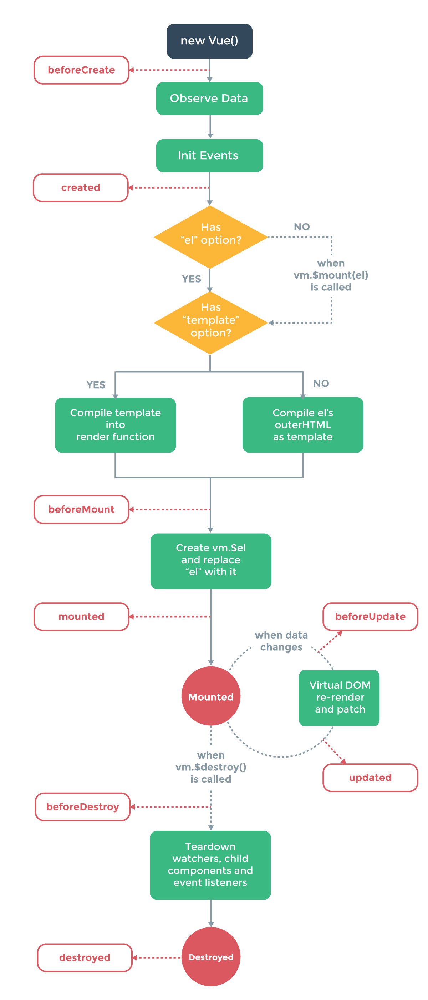
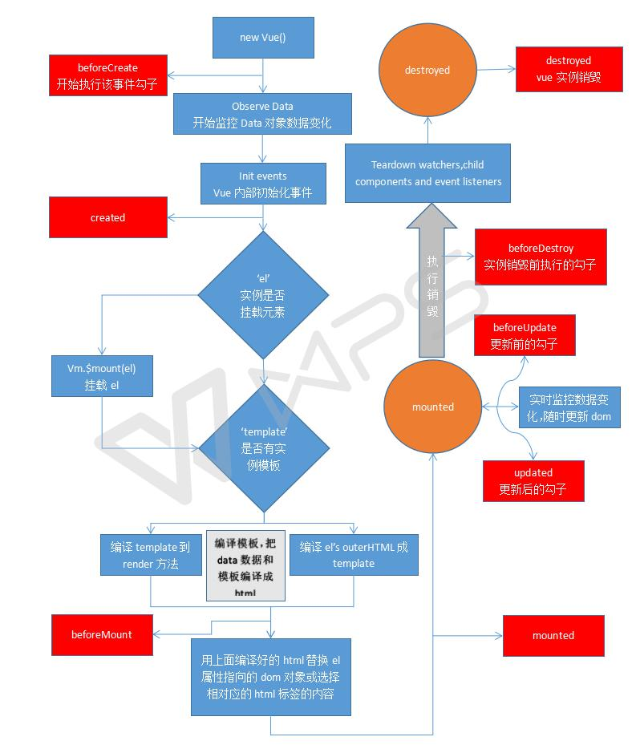

# VUE
### 构建项目

全局安装 vue-cli
`npm install -g vue-cli`

全局安装webpack
`npm install -g webpack`

创建一个基于 "webpack" 模板的新项目
`vue init webpack my-project`

安装依赖,启动项目

    cd my-project
    npm install
    npm run dev

生成静态文件(/dist) config/index.js中build:设置为`assetsPublicPath: './'`

输出
`npm run build`

`npm i -S vue-router`
安装router组件

`npm install -g cnpm --registry=https://registry.npm.taobao.org`
安装cnpm

`npm install node-sass sass-loader --save`
安装sass依赖库

### 无解未知
1、绑定的数据过滤器
2、vuex

### vue语法
#### 1、属性绑定简写

        

        等价于
        

#### 2、绑定样式对象

        

        当 isActive为 true时， div就会具有了active样式类，
        如果 isActive为false，那么div就去掉active样式类。
        
        

        混合使用

#### 3、双向数据绑定(v-model)

        <input v-model="message" placeholder="edit me">
        
Message is: {{ message }}

#### 4、渲染

        v-if、v-else  条件渲染
        v-for   循环渲染

#### 5、事件修饰符

    <!-- 阻止单击事件冒泡 -->
    
    <!-- 提交事件不再重载页面 -->
    <form v-on:submit.prevent="onSubmit"></form>
    <!-- 修饰符可以串联  -->
    
    <!-- 只有修饰符 -->
    <form v-on:submit.prevent></form>
    <!-- 添加事件侦听器时使用事件捕获模式 -->
    
...

    <!-- 只当事件在该元素本身（而不是子元素）触发时触发回调 -->
    
...

    <!-- the click event will be triggered at most once -->
    

#### 6、按钮修饰符

    <!-- 只有在 keyCode 是 13 时调用 vm.submit() -->
    <input v-on:keyup.13="submit">
    记住所有的 keyCode 比较困难，所以 Vue 为最常用的按键提供了别名：
    <!-- 同上 -->
    <input v-on:keyup.enter="submit">
    <!-- 缩写语法 -->
    <input @keyup.enter="submit">

### vue生命周期

Vue的computed属性 (计算属性)

每个 Vue 实例在被创建之前都要经过一系列的初始化过程。
例如，实例需要配置数据观测(data observer)、编译模版、挂载实例到 DOM ，
然后在数据变化时更新 DOM 。在这个过程中，实例也会调用一些 生命周期钩子 ，
这就给我们提供了执行自定义逻辑的机会。

    created: function () {
        //在实例创建之后同步调用。此时实例已经结束解析选项，这意味着已建立：数据绑定，计算属性，方法，watcher/事件回调。
        //但是还没有开始 DOM 编译，$el 还不存在,但是实例存在,即this.a存在,可打印出来 。
        console.log("建立");
    },
    beforeCompile: function () {
        console.log("未开始编译");
    },
    compiled: function () {
        //在编译结束后调用。此时所有的指令已生效，因而数据的变化将触发 DOM 更新。但是不担保 $el 已插入文档。
        console.log("编译完成");
    },
    ready: function () {
        //在编译结束和 $el 第一次插入文档之后调用，如在第一次 attached 钩子之后调用。注意必须是由 Vue 插入（如 vm.$appendTo() 等方法或指令更新）才触发 ready 钩子。
        console.log("一切准备好了");
    },
    attached :function () {  //myVue.$appendTo(".test2")暂时触发不了,不知道怎么解决
        //在 vm.$el 插入 DOM 时调用。必须是由指令或实例方法（如 $appendTo()）插入，直接操作 vm.$el 不会 触发这个钩子。
        console.log("插入DOM成功");
    },
    detached :function () { //触发事件 myVue.$destroy(true),其中参数true控制是否删除DOM节点或者myVue.$remove()
        //在 vm.$el 从 DOM 中删除时调用。必须是由指令或实例方法删除，直接操作 vm.$el 不会 触发这个钩子。
        console.log("删除DOM成功");
    },
    beforeDestroy: function () {  //触发方式,在console里面打myVue.$destroy();
        //在开始销毁实例时调用。此时实例仍然有功能。
        console.log("销毁前");
    },
    destroyed: function () {   //触发方式,在console里面打myVue.$destroy();其中myVue.$destroy(true)是删除DOM节点,会触发detached函数,但是实例仍然存在
        //在实例被销毁之后调用。此时所有的绑定和实例的指令已经解绑，注意是解绑不是销毁,所有的子实例也已经被销毁。
        console.log("已销毁");
    }
Vue生命图示

